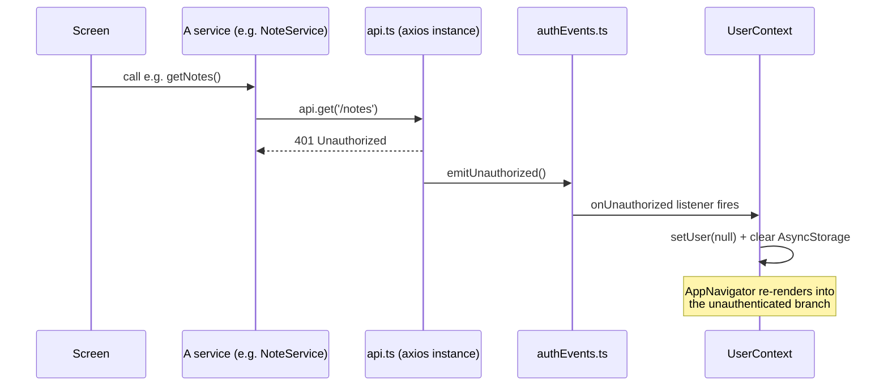

# Data Flow: A Worked Example

The previous three pages describe navigation, state, and the services layer in isolation. Here's how they actually work together, end to end.

## App launch → first screen

1. `UserProvider` mounts, `isLoadingUser` starts `true`.
2. It reads `user` from `AsyncStorage`. If a cached record with a plausible shape exists, it calls `UserService.getProfile()` to confirm the backend still accepts the cached token (see [State Management](/docs/architecture/state-management)) — it does not trust the cache blindly.
3. `isLoadingUser` flips to `false`. `AppNavigator` picks its screen set based on whether `setUser(...)` was called during step 2 — [Navigation](/docs/architecture/navigation)'s auth-gated branch.
4. A screen mounts and calls a service (e.g. `NoteService.getNotes(...)`), which goes through the shared `api` instance — the request interceptor attaches the token automatically.

## The one genuinely cross-cutting flow: forced logout on 401

This is the one flow in the app that isn't confined to a single file, and it's worth having a name for:

This can happen from **any** API call, at any point in the app — not just at launch. A token that expires mid-session, or gets revoked server-side while the app is open, produces the exact same result as a stale cache at launch: the user is bounced to the logged-out screen set on the very next request that hits the backend.

The reason this works cleanly without every screen needing to know about auth state is the decoupling described in [API & Services Layer](/docs/architecture/api-and-services-layer): `api.ts` only has to announce "a 401 happened," and `UserContext` (which already owns the navigation-determining `user` state) is the only thing that needs to react to it.
