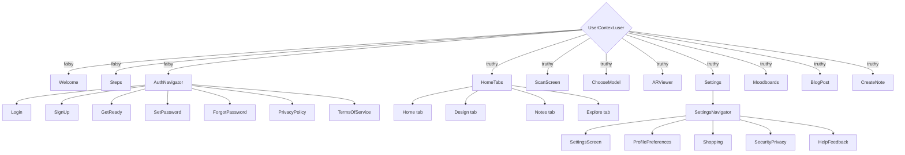

# Navigation

All navigation is a single root `createNativeStackNavigator` in `fe/src/navigation/AppNavigator.tsx`. There's no separate "auth stack" and "app stack" wired up side-by-side with a conditional switch between two navigator *instances* — it's simpler than that: **one navigator, whose set of registered screens is entirely a function of `user` from `UserContext`.**

```tsx
<Stack.Navigator screenOptions={{headerShown: false}}>
  {user ? (
    // ── Authenticated ──
    <>...</>
  ) : (
    // ── Unauthenticated ──
    <>...</>
  )}
</Stack.Navigator>
```

This matters more than it might look: when `user` is falsy, the authenticated screens (`HomeTabs`, `Settings`, `ScanScreen`, etc.) are **not merely hidden — they're never registered in the navigator at all.** There's no route for them to be navigated *to*. This is the standard, robust pattern for auth gating in React Navigation, and it means an unauthenticated user can't reach a protected screen via deep link, back button, or a stray `navigate()` call — there's simply nothing there to navigate to.

While `isLoadingUser` (the initial `AsyncStorage` restore) is still in flight, `AppNavigator` renders a blank splash-colored `View` and keeps the native boot splash up, calling `BootSplash.hide()` only once loading settles.

## The full branch



## Nested navigators

- **`AuthNavigator`** (nested stack, defined in the same file as `AppNavigator`): `Login`, `SignUp`, `GetReady`, `SetPassword`, `ForgotPassword`, `PrivacyPolicy`, `TermsOfService`.
- **`SettingsNavigator`** (nested stack, same file): `SettingsScreen`, `ProfilePreferences`, `Shopping`, `SecurityPrivacy`, `HelpFeedback`.
- **`HomeTabNavigator`** (`fe/src/navigation/HomeTabNavigator.tsx`, `createBottomTabNavigator`): `Home`, `Design`, `Notes`, `Explore`. A custom `TabHeader` component sits above the tab content — tapping the avatar navigates to `Settings > ProfilePreferences`, the gear icon to `Settings`.

## Deep links

`fe/src/utils/deepLinking.ts` exports `extractRecoveryToken(url)`, which parses Supabase password-recovery deep links (shape: `atsdecor://auth/reset-password#access_token=...`). `App.tsx` wires this up via `Linking.getInitialURL()` and a `Linking.addEventListener('url', ...)` subscription — if a recovery token is found, it navigates to `Auth > SetPassword` with `{accessToken}` as a param.

There's a real race handled explicitly here: the deep link can arrive before `NavigationContainer` is ready to accept a `navigate()` call. `App.tsx` handles this with a `pendingUrlRef` — if the nav container isn't ready yet, the URL is stashed and replayed from `NavigationContainer`'s `onReady` callback instead of being dropped.

## Navigation helpers

`fe/src/utils/navigation.ts` exports two small helpers used throughout screens instead of calling `navigation.navigate`/`navigation.goBack` directly: `goBack(navigation)` and `navigateTo(navigation, screen, params)`.
