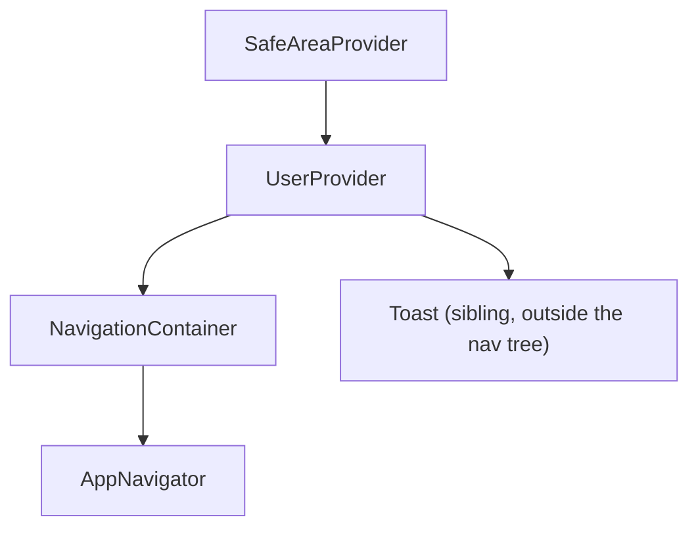

# Architecture Overview

The app's architecture is intentionally simple, and it's worth naming that plainly rather than implying more machinery than exists:

- **No Redux, Zustand, or MobX.** State management is one React Context (`UserContext`), `AsyncStorage` for persistence, and local component state (`useState`, `react-hook-form` for forms) everywhere else. See [State Management](/docs/architecture/state-management).
- **One shared axios instance** (`fe/src/config/api.ts`) with a request interceptor (attach the auth token) and a response interceptor (force logout on any `401`), and **8 thin service files**, each wrapping a specific backend domain. See [API & Services Layer](/docs/architecture/api-and-services-layer).
- **One custom hook**, `useBlogFeed.ts`, for paginated blog fetching. Everything else is plain component-local state and effects.
- **Navigation is a single root stack** that branches entirely on whether `user` is set. See [Navigation](/docs/architecture/navigation).

This isn't a gap to be filled in later so much as a reasonable choice for the app's current size — a single Context plus a thin service layer is easy to reason about end-to-end, and there's no cross-cutting global state complex enough to need a dedicated state library yet.

## Provider composition

Everything renders inside this tree, defined in `fe/App.tsx`:

`NavigationContainer` is created with a `ref` (`useNavigationContainerRef`), which `App.tsx` also uses directly for deep-link navigation — see [Navigation](/docs/architecture/navigation) for how a password-recovery link routes to `Auth > SetPassword` before the nav tree may even be ready.

## Reading order

If you're new to this codebase, read [Navigation](/docs/architecture/navigation) next — it's the single highest-leverage page in this section, since almost everything else (which screens exist, what's reachable when) follows from it.
