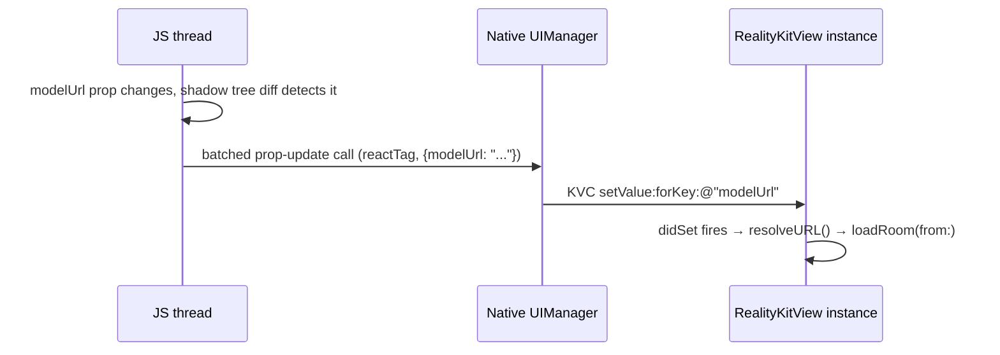

# Props: JS → Swift

Worked example: `<RealityKitNativeView modelUrl={modelUrl} .../>` in `ARViewerScreen.tsx`, and how that JS string ends up triggering `RealityKitView.loadRoom(from:)` in Swift.

## The declarations on each side

Swift (`RealityKitView.swift`):

```swift
@objc var modelUrl: NSString? {
    didSet {
        guard let urlStr = modelUrl as String?, let url = resolveURL(urlStr) else { return }
        loadRoom(from: url)
    }
}
```

Objective-C shim (`RealityKitViewManager.m`):

```objectivec
RCT_EXPORT_VIEW_PROPERTY(modelUrl, NSString)
```

That's the entire declaration on both sides. There's no explicit "setModelUrl" method anywhere, and no function that gets called when the prop changes — Swift's `didSet` property observer *is* the setter, from RN's point of view.

## The hop-by-hop sequence



1. **Shadow tree diff.** React Native's shadow tree (running off the JS thread) computes, for each native view whose props changed since the last render, exactly which prop keys have new values.
2. **Batched native call.** That diff is sent across the bridge as a batched `UIManager` call, keyed by the view's react tag.
3. **KVC application.** `RCTUIManager` looks up the live `UIView` instance for that react tag and applies each changed prop using the setter mechanism the `.m` file's `RCT_EXPORT_VIEW_PROPERTY(modelUrl, NSString)` registered — for a plain `NSString` property like this, RN's default is exactly `[view setValue:jsValue forKey:@"modelUrl"]`, i.e. ordinary Key-Value Coding.
4. **`didSet` fires.** KVC setting the property through Swift's synthesized setter triggers the `didSet` observer, which is where the actual side effect (parsing the URL, kicking off an async model load) lives.

This is why `modelUrl` has no explicit setter method in the Swift source: from the bridge's perspective, KVC *is* the setter, and Swift's `didSet` is just how you observe a KVC-driven change from inside the class.

## What `resolveURL` does with the value

Not part of the bridge mechanism itself, but worth knowing since it's the very next thing that runs: `resolveURL` in `RealityKitView.swift` handles three URL shapes — `"bundle://name.usdz"` (resolved against the app bundle, for bundled test/template assets), a plain `"https://..."` URL, or a local `"file://..."` URL — before handing off to `loadRoom(from:)`, which itself caches remote downloads to the app's caches directory (see the `localFileURL(for:)` helper) rather than re-downloading on every load.
