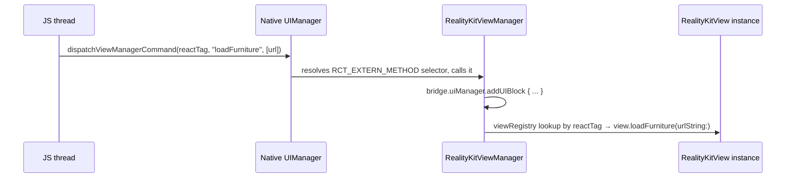

# Commands: JS → Swift, Imperatively

Props (previous page) are for *declarative* state — "this is what the view's `modelUrl` should be right now." Commands are for *imperative* actions — "load this furniture piece now," triggered by a button tap, not by any prop changing. Worked example: `loadFurnitureCommand(ref, urlString)` in `RealityKitView.native.tsx`, ending in a call to `RealityKitView.loadFurniture(urlString:)`.

## The JS side

```tsx
export const loadFurnitureCommand = (ref: React.RefObject<any>, urlString: string) => {
  UIManager.dispatchViewManagerCommand(
    findNodeHandle(ref.current),
    UIManager.getViewManagerConfig('RealityKitView').Commands.loadFurniture,
    [urlString],
  );
};
```

`findNodeHandle(ref.current)` resolves a React ref to the numeric react tag of the underlying native view — the same identifier used for prop updates. `UIManager.getViewManagerConfig('RealityKitView').Commands` is the JS-visible form of the constants dictionary the manager exports (see below) — this is why command names have to exist there before they can be dispatched.

## Where the command IDs come from

Back in `RealityKitViewManager.swift`:

```swift
override func constantsToExport() -> [AnyHashable: Any]! {
    [
        "Commands": [
            "loadFurniture": "loadFurniture",
            "toggleTopView": "toggleTopView",
            "resetCamera": "resetCamera",
            "captureSnapshot": "captureSnapshot",
            "removeSelectedFurniture": "removeSelectedFurniture",
        ],
    ]
}
```

`constantsToExport()` is sent to JS once, when the native module is set up — this is what `UIManager.getViewManagerConfig('RealityKitView').Commands` actually resolves to on the JS side.

:::note A minor deviation from the usual RN convention
Most RN examples/docs show command IDs as small integers (`0`, `1`, `2`, ...). Here, each command's "ID" is just its own name as a string (`"loadFurniture": "loadFurniture"`). This works fine — `dispatchViewManagerCommand` accepts either form — but if you're used to seeing numeric command IDs elsewhere, that's why this looks different.
:::

## The Swift-side handler

```swift
@objc func loadFurniture(_ reactTag: NSNumber, urlString: NSString) {
    bridge.uiManager.addUIBlock { _, viewRegistry in
        guard let view = viewRegistry?[reactTag] as? RealityKitView else { return }
        view.loadFurniture(urlString: urlString as String)
    }
}
```

This lives on the **manager**, not the view — and its whole body is dedicated to finding the actual view instance and delegating to it.

## The hop-by-hop sequence



1. `UIManager.dispatchViewManagerCommand` sends a batched, asynchronous native call across the bridge, targeting `RCTUIManager`'s command-dispatch entrypoint.
2. `RCTUIManager` looks up which view manager owns the given react tag's component type (`RealityKitViewManager`), finds the command in its exported `Commands` map, and invokes the matching Objective-C selector — resolved by the same runtime name-matching mechanism from [page 02](/docs/native-bridge/registration-and-runtime-matching), landing on the real Swift method.
3. **Why the `addUIBlock` indirection exists**: manager methods can be invoked before the view registry is guaranteed to be in a consistent state (native module methods and view lifecycle aren't strictly ordered relative to each other on the bridge). `bridge.uiManager.addUIBlock { ... }` schedules the block to run on the UI manager's dedicated queue, at a point where looking up a specific view by react tag is safe. This is RN's standard idiom for "do something to one specific native view" from inside a manager method — you'll see the identical pattern in every command handler in both `RealityKitViewManager` and `RoomplanViewManager`.
4. Only once the view is safely found does the manager call the actual application-level method — `view.loadFurniture(urlString:)` — which is where the real work (loading the USDZ, showing a toast) happens.
