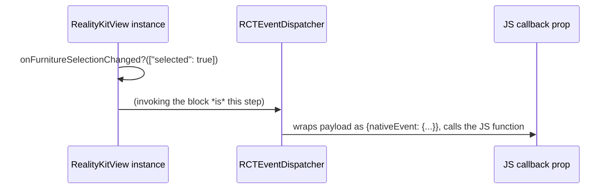

# Events: Swift → JS

The reverse direction from the previous two pages. Worked example: `onFurnitureSelectionChanged`, fired when the user taps a piece of placed furniture, ending in a call to whatever function was passed as that prop in `ARViewerScreen.tsx`.

## The declaration

```swift
@objc var onFurnitureSelectionChanged: RCTDirectEventBlock?
```

```objectivec
RCT_EXPORT_VIEW_PROPERTY(onFurnitureSelectionChanged, RCTDirectEventBlock)
```

`RCTDirectEventBlock` is a bridge-defined closure type — think of it as a pre-wired callback slot, not an ordinary stored closure you assign yourself. When RN sees a JS prop with this name whose value is a function, it doesn't try to KVC a JS function into a Swift property (that wouldn't make sense) — it synthesizes and assigns an actual block into that property, one that already knows how to route a call back through the bridge to whichever JS function was passed as `onFurnitureSelectionChanged` on this specific element.

## Firing the event

```swift
private func setSelectedFurniture(_ entity: Entity?) {
    let changed = selectedFurniture !== entity
    selectedFurniture = entity
    if changed {
        onFurnitureSelectionChanged?(["selected": entity != nil])
    }
}
```

There's no separate "emit" or "send" API. **Invoking the closure is the act of sending the event.** `onFurnitureSelectionChanged?(["selected": entity != nil])` reads like calling an ordinary optional closure because, syntactically, it is one — the bridge machinery that turns that call into an actual cross-thread JS invocation is entirely hidden behind the block RN assigned into this property.

## The JS side

```tsx
<RealityKitNativeView
  onFurnitureSelectionChanged={e => setFurnitureSelected(e.nativeEvent.selected)}
/>
```

Native code passes a flat dictionary (`["selected": Bool]`). JS receives it wrapped: `e.nativeEvent.selected`. The bridge does this wrapping — every native-originated event gets shaped into a synthetic `{nativeEvent: {...}}` object before being handed to the JS callback, regardless of what the native side actually sent.

## The hop-by-hop sequence



## Direct vs. bubbling events

`RCTDirectEventBlock` fires exactly once per native call, delivered straight to the JS component that owns this exact view — no propagation semantics. The alternative, `RCTBubblingEventBlock`, is meant to bubble up through the RN view hierarchy the way a DOM event would, letting an ancestor component's matching prop handler intercept it too.

`RealityKitView` uses `RCTDirectEventBlock` for both its events, which is the right choice here — nothing about furniture selection or snapshot completion needs to propagate to a parent view. [Page 08](/docs/native-bridge/roomplanview-walkthrough) covers a real bug in this exact codebase where `RoomplanView`'s events were declared as one type in one file and the other type in a second, conflicting file — a concrete illustration of what getting this choice wrong (or just inconsistent) actually looks like in shipped code.
